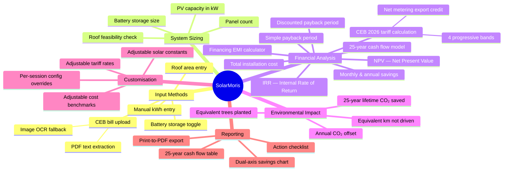
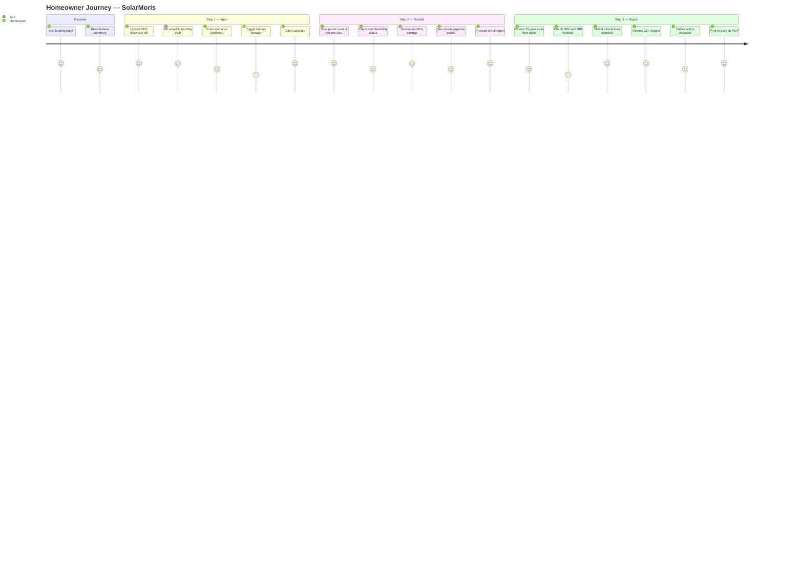
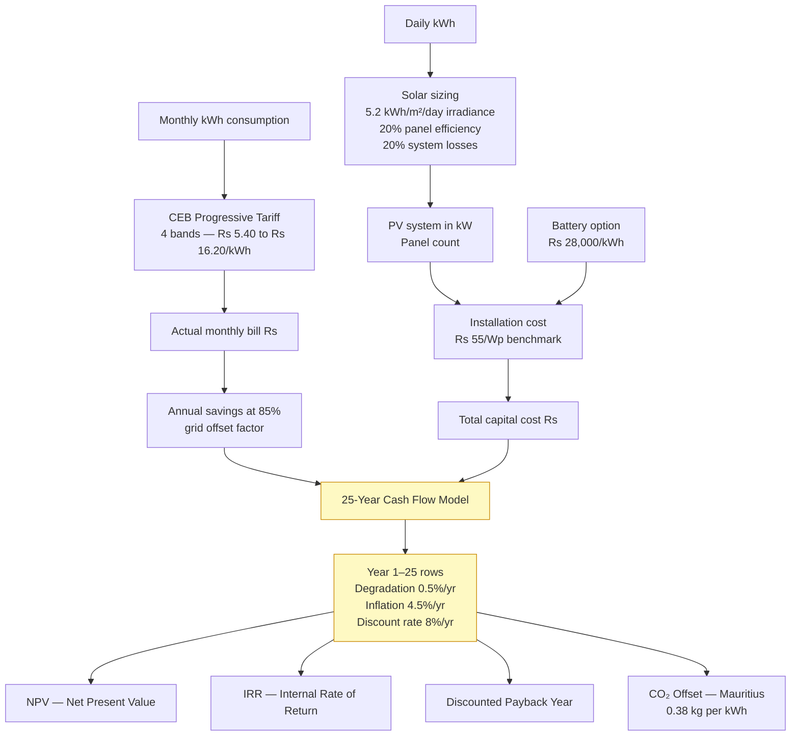
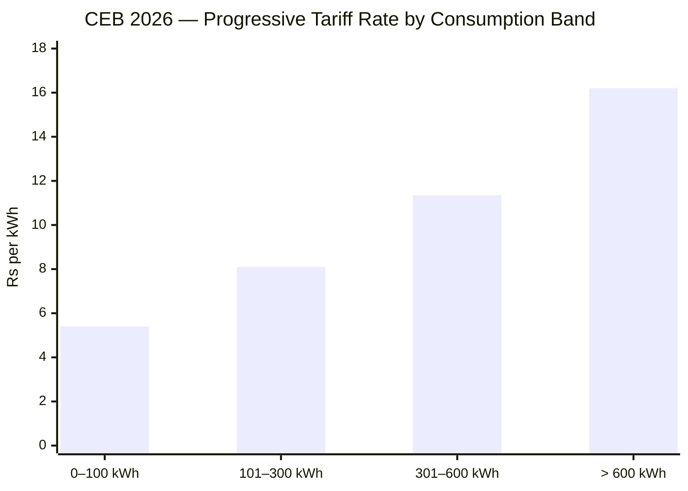
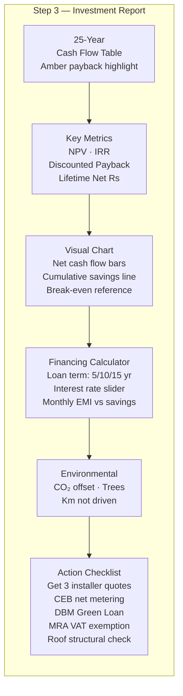
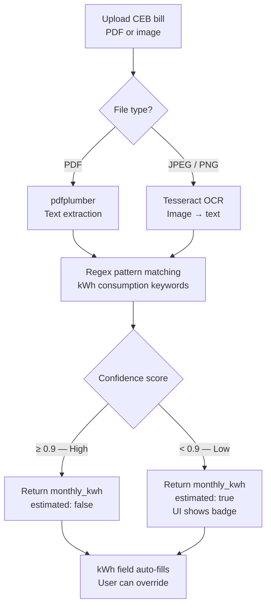
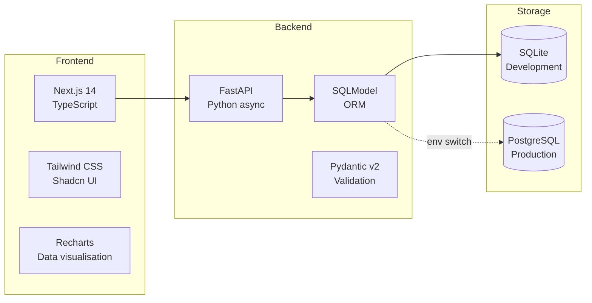
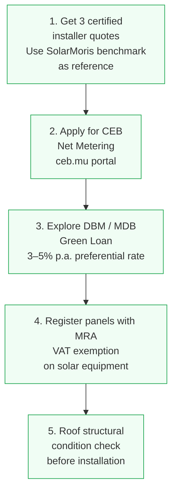

# SolarMoris — Project Presentation

**Hybrid Solar Feasibility & ROI Planning Tool for Mauritius**

---

## Slide 1 — The Problem

### Electricity in Mauritius is Getting Expensive

Mauritius homeowners face a double pressure: rising CEB electricity tariffs and growing awareness of climate impact. Yet most households have no practical way to evaluate whether solar makes financial sense **for their specific situation**.

The barriers to making an informed decision are real:

- Installer quotes vary widely and take weeks to obtain
- CEB tariff bands are progressive and non-obvious to calculate manually
- Financial metrics like NPV, IRR, and discounted payback are opaque without specialist tools
- No single tool combines system sizing, accurate tariff modelling, 25-year projections, and financing scenarios in one place

**The result:** most homeowners either delay the decision indefinitely or commit to a system without understanding the true return on investment.

---

## Slide 2 — The Solution

### SolarMoris: From Electricity Bill to Investment Decision in Minutes

SolarMoris is a free, browser-based feasibility tool that guides a homeowner through three steps:

At the end of Step 3, the homeowner has everything they need to:
1. Compare installer quotes against an independent benchmark
2. Understand the exact month their investment breaks even
3. Model the impact of a green loan before signing
4. Quantify their environmental contribution

---

## Slide 3 — Who It Is For

| User | What They Get |
|------|--------------|
| **Homeowner considering solar** | Instant sizing estimate and payback period without waiting for an installer quote |
| **Homeowner with an installer quote** | Independent cross-check of the quoted system size and claimed savings |
| **Homeowner evaluating financing** | Live EMI calculator with adjustable term and interest rate |
| **Energy-conscious household** | CO₂ offset, equivalent trees planted, and km of petrol driving avoided |

---

## Slide 4 — Feature Map

---

## Slide 5 — The User Journey

---

## Slide 6 — Accurate Financial Modelling

### Why accuracy matters

Most online solar calculators use a flat electricity rate and a simple payback formula. SolarMoris models the investment the way a financial analyst would.

### Key financial assumptions

| Parameter | Value | Basis |
|-----------|-------|-------|
| Inflation rate | 4.5% | Mauritius CPI |
| Discount rate (WACC) | 8.0% | Cost of capital |
| Panel degradation | 0.5%/yr | Manufacturer data |
| System cost | Rs 55/Wp | 2026 Mauritius benchmark |
| Battery cost | Rs 28,000/kWh | 2026 market rate |
| Maintenance | Rs 1,200/kW/yr | Industry standard |
| Project horizon | 25 years | Standard panel lifetime |

---

## Slide 7 — The CEB Tariff Model

Mauritius uses a **progressive block tariff** — households consuming more pay a higher marginal rate. A flat-rate calculator systematically underestimates savings for high-consumption homes.

**Example — 350 kWh/month household:**

| Band | kWh Used | Rate (Rs/kWh) | Cost (Rs) |
|------|----------|----------------|-----------|
| 1 | 100 | 5.40 | 540 |
| 2 | 200 | 8.10 | 1,620 |
| 3 | 50  | 11.35 | 567.50 |
| **Total** | **350** | — | **2,727.50/month** |

A flat-rate tool using 8.10 Rs/kWh would estimate Rs 2,835 — a 4% error that compounds over 25 years into a significant NPV miscalculation.

---

## Slide 8 — The 25-Year Report

The centrepiece of SolarMoris is a complete investment report that no installer tool currently provides to Mauritius homeowners.

**The financing section** is particularly useful: it answers the question most homeowners actually ask — *"If I take a bank loan, am I cash-flow positive from day one?"*

At 7% interest over 10 years on a Rs 280,000 system, the monthly EMI is approximately Rs 3,254. For a 350 kWh/month household saving Rs 2,320/month, the net monthly cost is only Rs 934 — often less than the household's current bill increase year-on-year.

---

## Slide 9 — Bill Upload & OCR

Homeowners do not need to know their monthly kWh. They can photograph or scan their CEB bill.

The confidence score prevents silent errors: if the parser matched on a generic keyword like "units" rather than a specific CEB pattern, the frontend displays an *"estimated"* badge so the user knows to verify.

---

## Slide 10 — Technical Highlights

### Why these choices matter to users

| Design Decision | User Benefit |
|-----------------|-------------|
| Calculation is **stateless** (no login required) | Any visitor can get a result in seconds — no sign-up friction |
| **25-year model runs in the browser** | Results update instantly when financing sliders change |
| **Config overrides** per session | Power users can adjust tariff rates or system costs without admin access |
| **CEB 2026 4-band tariff** (not flat rate) | Accurate bill estimate — especially important for high-consumption homes |
| **Discounted payback** (not simple payback) | Accounts for time value of money — more conservative and honest |
| **Print to PDF** (native browser) | No server-side rendering cost; works offline after page load |

### Stack at a glance

---

## Slide 11 — Environmental Impact

Solar in Mauritius offsets grid electricity generated primarily from coal and oil, at **0.38 kg CO₂ per kWh**.

For a typical 350 kWh/month household with a 2.8 kW system:

| Metric | Year 1 | 25 Years |
|--------|--------|----------|
| CO₂ offset | ~1,360 kg | ~29,000 kg |
| Equivalent trees | — | ~1,381 trees |
| Equivalent km not driven | — | ~242,000 km |

SolarMoris displays these numbers in the report to give the financial decision an environmental dimension — relevant for households motivated by sustainability alongside cost.

---

## Slide 12 — Action Plan: What Happens After the Report

The report closes with a concrete five-step checklist:

Each step is actionable — the app does not just present numbers, it tells the user what to do next.

---

## Slide 13 — Roadmap Opportunities

| Priority | Feature | Value |
|----------|---------|-------|
| High | User accounts — save and compare multiple assessments | Return visits; portfolio tracking |
| High | Email report delivery | Share with spouse, accountant, or installer |
| Medium | Installer directory integration | Close the loop from analysis to quote |
| Medium | Real-time CEB tariff updates | Evergreen accuracy without code changes |
| Medium | Multi-property dashboard | Landlords and SMEs with multiple sites |
| Low | Mobile app (PWA) | Field use during site surveys |
| Low | Arabic / French localisation | Broader Mauritius audience |

---

## Slide 14 — Summary

**SolarMoris solves a real, underserved problem** for Mauritius homeowners who want to make an informed solar investment decision without relying solely on an installer's word.

### What sets it apart

- **Accuracy:** CEB 2026 progressive tariff modelling, not a flat-rate approximation
- **Completeness:** From bill upload through to 25-year NPV, IRR, and financing in one session
- **Transparency:** Step-by-step formula explanations; open methodology
- **Actionability:** Closes with a concrete checklist, not just a number
- **Accessibility:** No login required to get a full analysis; works on any browser

### The numbers that matter

For a median Mauritius household consuming **350 kWh/month**:

| Metric | Value |
|--------|-------|
| System size | ~2.8 kW (7 panels) |
| Roof required | ~14 m² |
| Total cost | ~Rs 154,000 |
| Monthly savings | ~Rs 2,320 |
| Simple payback | ~5.5 years |
| 25-year net gain | ~Rs 500,000+ |
| CO₂ saved (lifetime) | ~29 tonnes |

---

*SolarMoris — making solar investment decisions transparent, accurate, and accessible for every Mauritius household.*
